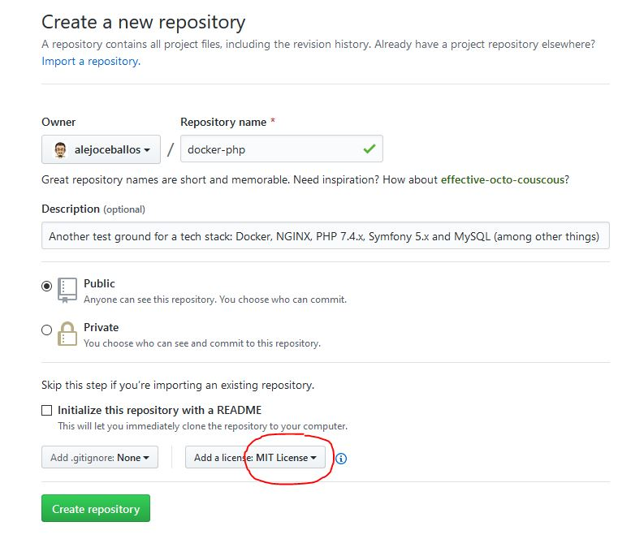

[<< Previous: Main page](../README.md)

---

# Version Manager: Start the Git repository

### Goal
Locally initialize a Git repository and push it to GitHub.

I believe everyone that come across this, may be able to create a Git repository. But that's some tutorial that I never
did and have no repo to remember me commands or things for easy reference. So I'll start here and it will grow while
questions are answered. 

## Installing Git

### Windows
I've followed what is used here. Not much else to be done. If these links become outdated I may visit this section 
again:
- https://www.atlassian.com/git/tutorials/install-git#windows
- https://gitforwindows.org/

### Ubuntu
Pretty straightforward:
```shell script
sudo apt-get update
sudo apt-get install -y git
```

## Creating a repository

References:
- https://www.atlassian.com/git/tutorials/setting-up-a-repository
- https://ivan.bessarabov.com/blog/cloning-git-repo-withou-git-clone
- https://www.sitereq.com/post/3-ways-to-create-git-local-and-remote-repositories

There are a numerous ways to create a repository. In my opinion, creating it at GitHub and cloning it locally is the 
easier one. But this time I tried another path, just for fun.

**NOTE:** I was already using git before this tutorial, so some steps like saving my username, email, password or token
was already done. In case someone need it, for now, will have to figure it out by itself. 

#### 1) Go to the project folder for the repo:
```shell script
cd /path/to/the/project
```

#### 2) Initialize it:
```shell script
git init
```
```
Initialized empty Git repository in /path/to/the/project/.git/ 
```

#### 3) Create any file for the first commit:
```shell script
echo "# Docker, NGINX, PHP 7.4.x, Symfony 5.x and MySQL (almost) from scratch!" >> README.md
```

#### 4) Stage this file
```shell script
git add README.md
``` 

#### 5) Commit the file
```shell script
git commit -m "First commit: README.md"
```

#### 6) Link local repos to a remote repo
```shell script
git remote add origin https://github.com/thegithubuser/projectname.git
```

#### 7) Create the remote repo
I would like to prevent from going to GitHub site to having to create the repo, but couldn't find how. Perhaps using its 
API... But that's for another time.

Go to https://github.com, log in with git's credentials then press the "New Repository" green button.

In the image below is an example of my repo creation settings. No README file, since it was already created, but I do 
like to have a MIT license right out from the oven! 



#### 8) Grab what's in the remote repo
```shell script
git branch --set-upstream-to=origin/master master
```
```
Branch 'master' set up to track remote branch 'master' from 'origin'.
```
```shell script
git pull --rebase
```
```
Successfully rebased and updated refs/heads/master.
```

#### 9) Push the commit to the remote repo
```shell script
git push
```
```
Enumerating objects: 22, done.
Counting objects: 100% (22/22), done.
Delta compression using up to 8 threads
Compressing objects: 100% (15/15), done.
Writing objects: 100% (21/21), 53.76 KiB | 7.68 MiB/s, done.
Total 21 (delta 2), reused 0 (delta 0), pack-reused 0
remote: Resolving deltas: 100% (2/2), done.
To https://github.com/alejoceballos/docker-php.git
   2273696..c35f4ff  master -> master
```
I actually had more things than just a README.md file, but the result message should be quite similar.

---

[Next: Docker >>](DOCKER.md)
