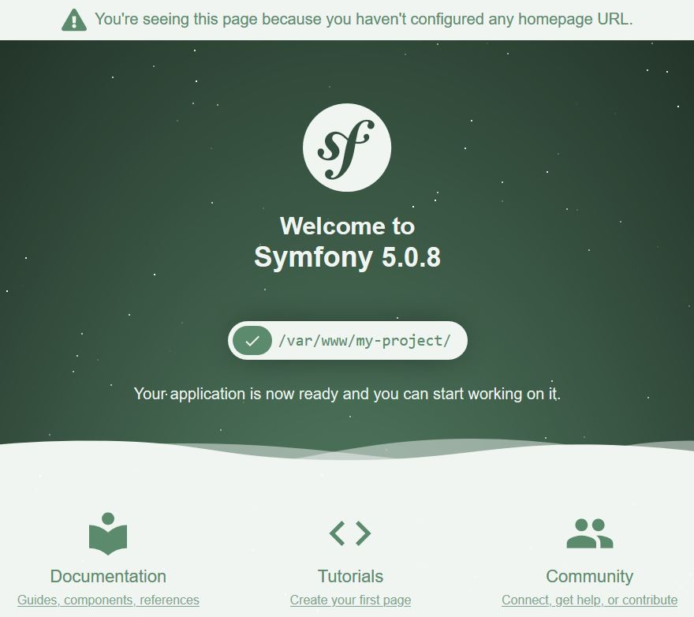

[<< Previous: Docker](DOCKER.md)

---

# Development: Create the Symfony application

The backend application being created is handled by Symfony framework. An MVC framework that manages 
Dependency Injection for the developer, among another huge set of bundles that make our lives easier.

All our application dynamics will be managed by the PHP-FPM inside the container. All terminal commands must be 
performed inside the container and only the code may be edited outside since it will be stored in a shared volume.

References:
- https://symfony.com/
- https://symfony.com/doc/current/setup.html
- https://martinfowler.com/eaaDev/uiArchs.html#ModelViewController
- https://martinfowler.com/articles/injection.html

## Create the application

### Using Symfony CLI

Enter PHP-FPM container:
```shell script
docker exec -it docker-php_docker-php-fpm_1 bash
```

Go to the declared applications folder:
```shell script
cd /var/www
```

#### Checking Symfony requirements
Check if all symfony requirements apply:
```shell script
symfony check:requirements
```
```
Symfony Requirements Checker
~~~~~~~~~~~~~~~~~~~~~~~~~~~~

> PHP is using the following php.ini file:
/usr/local/etc/php/php.ini

> Checking Symfony requirements:

................................


 [OK]
 Your system is ready to run Symfony projects
```

#### Registering Git user
Register the git user to be able to download needed artifacts:
```shell script
git config --global user.email "user@example.com"
git config --global user.name "User Name"
```

#### Creating a web application skeleton
Create a new project (change `my-project` for the name of the project created):
```shell script
symfony new my-project --full
```
```
* Creating a new Symfony project with Composer
  (running /usr/local/bin/composer create-project symfony/website-skeleton /var/www/my-project)

* Setting up the project under Git version control
  (running git init /var/www/my-project)


 [OK] Your project is now ready in /var/www/my-project
```
**NOTE:** The very first time the command above is ran, it may ask for a password of some sort. A token on GitHub may
be created to be used by third-party applications in the current user's name. This tutorial is a TBD right now.

#### SPECIAL NOTE!
The previous command creates a full prepared web application skeleton, with lot of bundles and infrastructure ready. If 
the only thing needed is a microservice, console application or an API, run the following:
```shell script
symfony new my-project
```
```
* Creating a new Symfony project with Composer
  (running /usr/local/bin/composer create-project symfony/skeleton /var/www/my-project)

* Setting up the project under Git version control
  (running git init /var/www/my-project)


 [OK] Your project is now ready in /var/www/my-project
```
Leave PHP-FPM container:
```shell script
exit
```

### Linking NGINX to the application

If the Symfony application was named `my-project`, nothing needs to be changed, if not, Edit 
`docker-nginx/etc/nginx/conf.d/site.conf`, Check the following line and change `my-project` for the name of the project 
created.
```smartyconfig
root /var/www/my-project/public;
```

Enter NGINX container:
```shell script
docker exec -it docker-php_docker-nginx_1 bash
```

Restart NGINX:
```shell script
/etc/init.d/nginx restart
```
```
[ ok ] Restarting nginx: nginx.
```

### Check Everything is okay!

Both servers are running and NGINX must be serving the Symfony application. Just go to `http://localhost:8080` on the
browser.



## Creating a controller:

**NOTE:** the following steps must be performed executing bash inside the PHP container.

In the project folder:
```shell script
cd /var/www/my-project/
```

To create a controller named `Default`:
```shell script
bin/console make:controller DefaultController
```
```
 created: src/Controller/DefaultController.php
 created: templates/default/index.html.twig

  Success!

 Next: Open your new controller class and add some pages!
```
There should be possible to access the newly created page rendered by the controller at `http://localhost:8080/default`. 

#### Pitfall
**NOTE (again):** If the project wasn't created with the `--full` flag the following error will be displayed:
```
 [ERROR] Missing package: to use the make:controller command, run:

         composer require doctrine/annotations
```
To prevent this, two specific bundles created to ease development must be installed. But for learning purposes, I 
strongly recommend creating it with the `--full` flag. Please refer to [Symfony Maker](SYMFONY-BUNDLES.md#symfony-maker) 
and [Doctrine](SYMFONY-BUNDLES.md#doctrine).

### Controllers, routes and templates

The previous command will create a class (controller), responsible for rendering an html (template) and reachable 
through a route (configuration or annotation).
```php
<?php

namespace App\Controller;

use Symfony\Bundle\FrameworkBundle\Controller\AbstractController;
use Symfony\Component\Routing\Annotation\Route;

class DefaultController extends AbstractController
{
    /**
     * @Route("/default", name="default")
     */
    public function index()
    {
        return $this->render('default/index.html.twig', [
            'controller_name' => 'DefaultController',
        ]);
    }
}
```

One interesting detail on this class creation is the namespace starting with `App`. It is defined in the `composer.json`
file. 
```smartyconfig
    .
    .
    .
    "autoload": {
        "psr-4": {
            "App\\": "src/"
        }
    },
    .
    .
    .
```
So if the base namespace needs to mirror the application name, change `App` for the one that suits it better, 
`MyProject` for example.

#### The controller
Controllers are always created in the `Controller` folder. In this Symfony version there is no need to explicitly define 
the controller inside a yaml configuration file since they are automatically loaded thanks to a general configuration in
the `config/services.yaml`.
```smartyconfig
    .
    .
    .
    App\Controller\:
        resource: '../src/Controller'
        tags: ['controller.service_arguments']
    .
    .
    .
```

Even thought there is no need to extend from `AbstractController`, it delivers out-of-the-box helper methods like the 
one used to render the `twig` template or another to return a JSON response, for example:
```php
<?php
    .
    .
    .
    /**
     * @Route("/json", name="whatever")
     */
    public function notTheIndex()
    {
        return $this->json(['data' => 'response data']);
    }
    .
    .
    .
```
Check `http://127.0.0.1:8080/json`. The JSON is returned as the response.

#### The route
In previous versions of Symfony, the way to declare a route to this controller would be to define it in 
`config/routes.yaml`.
```smartyconfig
default:
    path: /default
    controller: App\Controller\DefaultController::index
```

Using annotations in the method's comment it is possible to achieve the same result without overloading the routes file.
```
@Route("/default", name="default")
```

This configuration (file or annotation) redirects requests from the `/default` url path to the `index` method in the
`DefaultController` class. 

#### The template
The default template engine in the Symfony framework is [Twig](https://twig.symfony.com/). It is modern template engine
like many others, and although Single Page Applications (SPAs) are the hype of the moment throwing server compiled
template engines to ostracism, it may be very helpful for creating dynamic emails or other form of less dynamic 
information.

The maker command generates a default template page in the `templates` folder. Check for 
`templates/default/index.html.twig`.

---

[Next: Symfony Controllers >>](SYMFONY-CONTROLLER.md)
